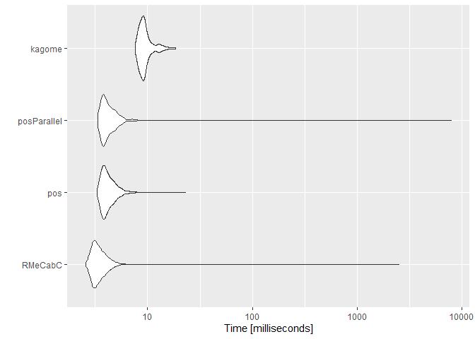

<!-- README.md is generated from README.Rmd. Please edit that file -->

# RcppKagome <a href='https://paithiov909.github.io/RcppKagome'></a>

<!-- badges: start -->

[](#)
[](https://www.tidyverse.org/lifecycle/#experimental)
[](https://github.com/paithiov909/RcppKagome/actions)
[](https://codecov.io/gh/paithiov909/RcppKagome?branch=main)
<!-- badges: end -->

RcppKagome is an R interface to
[ikawaha/kagome](https://github.com/ikawaha/kagome); Self-contained
Japanese morphological analyzer written in pure Go.

## System Requirements

-   GNU make
-   GNU GCC
-   Go (>= 1.16)
-   Kagome (v2 or later)

## Installation

``` r
remotes::install_github(
  "paithiov909/RcppKagome"
  #, INSTALL_opts = "--no-multiarch"  # for windows user
)
```

Note that the installation RcppKagome from source package requires
ikawaha/kagome (v2 or later).

By default, the package uses a static library generated with Cgo, which
contains the Japanese IPA dictionary.

However, you can also specify another dictionary to be bundled before
build and install the package. If you would like to use another one,
please set `RCPPKAGOME_DIC` as an evironment variable.

``` r
Sys.setenv(RCPPKAGOME_DIC = "uni") # for using uni-dic
# Or
Sys.setenv(RCPPKAGOME_DIC = "ko") # for using mecab-ko-dic
```

## Usage

### Call Kagome

``` r
res <- RcppKagome::kagome("雨にも負けず　風にも負けず")
str(res)
#> List of 1
#>  $ :List of 11
#>   ..$ 0 :List of 5
#>   .. ..$ Id     : int 376225
#>   .. ..$ Start  : int 0
#>   .. ..$ End    : int 1
#>   .. ..$ Surface: chr "雨"
#>   .. ..$ Feature: chr [1:9] "名詞" "一般" "*" "*" ...
#>   ..$ 1 :List of 5
#>   .. ..$ Id     : int 53040
#>   .. ..$ Start  : int 1
#>   .. ..$ End    : int 2
#>   .. ..$ Surface: chr "に"
#>   .. ..$ Feature: chr [1:9] "助詞" "格助詞" "一般" "*" ...
#>   ..$ 2 :List of 5
#>   .. ..$ Id     : int 73244
#>   .. ..$ Start  : int 2
#>   .. ..$ End    : int 3
#>   .. ..$ Surface: chr "も"
#>   .. ..$ Feature: chr [1:9] "助詞" "係助詞" "*" "*" ...
#>   ..$ 3 :List of 5
#>   .. ..$ Id     : int 352000
#>   .. ..$ Start  : int 3
#>   .. ..$ End    : int 5
#>   .. ..$ Surface: chr "負け"
#>   .. ..$ Feature: chr [1:9] "動詞" "自立" "*" "*" ...
#>   ..$ 4 :List of 5
#>   .. ..$ Id     : int 36553
#>   .. ..$ Start  : int 5
#>   .. ..$ End    : int 6
#>   .. ..$ Surface: chr "ず"
#>   .. ..$ Feature: chr [1:9] "助動詞" "*" "*" "*" ...
#>   ..$ 5 :List of 5
#>   .. ..$ Id     : int 95
#>   .. ..$ Start  : int 6
#>   .. ..$ End    : int 7
#>   .. ..$ Surface: chr "　"
#>   .. ..$ Feature: chr [1:9] "記号" "空白" "*" "*" ...
#>   ..$ 6 :List of 5
#>   .. ..$ Id     : int 380203
#>   .. ..$ Start  : int 7
#>   .. ..$ End    : int 8
#>   .. ..$ Surface: chr "風"
#>   .. ..$ Feature: chr [1:9] "名詞" "一般" "*" "*" ...
#>   ..$ 7 :List of 5
#>   .. ..$ Id     : int 53040
#>   .. ..$ Start  : int 8
#>   .. ..$ End    : int 9
#>   .. ..$ Surface: chr "に"
#>   .. ..$ Feature: chr [1:9] "助詞" "格助詞" "一般" "*" ...
#>   ..$ 8 :List of 5
#>   .. ..$ Id     : int 73244
#>   .. ..$ Start  : int 9
#>   .. ..$ End    : int 10
#>   .. ..$ Surface: chr "も"
#>   .. ..$ Feature: chr [1:9] "助詞" "係助詞" "*" "*" ...
#>   ..$ 9 :List of 5
#>   .. ..$ Id     : int 352000
#>   .. ..$ Start  : int 10
#>   .. ..$ End    : int 12
#>   .. ..$ Surface: chr "負け"
#>   .. ..$ Feature: chr [1:9] "動詞" "自立" "*" "*" ...
#>   ..$ 10:List of 5
#>   .. ..$ Id     : int 36553
#>   .. ..$ Start  : int 12
#>   .. ..$ End    : int 13
#>   .. ..$ Surface: chr "ず"
#>   .. ..$ Feature: chr [1:9] "助動詞" "*" "*" "*" ...
```

### Prettify Output

``` r
res <- RcppKagome::kagome(
  c(
    "陽が照って鳥が啼き　あちこちの楢の林も、けむるとき",
    "ぎちぎちと鳴る　汚い掌を、おれはこれからもつことになる"
  )
)
res <- RcppKagome::prettify(res)
str(res)
#> 'data.frame':    32 obs. of  11 variables:
#>  $ doc_id     : Factor w/ 2 levels "1","2": 1 1 1 1 1 1 1 1 1 1 ...
#>  $ token      : chr  "陽" "が" "照っ" "て" ...
#>  $ POS1       : chr  "名詞" "助詞" "動詞" "助詞" ...
#>  $ POS2       : chr  "一般" "格助詞" "自立" "接続助詞" ...
#>  $ POS3       : chr  NA "一般" NA NA ...
#>  $ POS4       : chr  NA NA NA NA ...
#>  $ X5StageUse1: chr  NA NA "五段・ラ行" NA ...
#>  $ X5StageUse2: chr  NA NA "連用タ接続" NA ...
#>  $ Original   : chr  "陽" "が" "照る" "て" ...
#>  $ Yomi1      : chr  "ヒ" "ガ" "テッ" "テ" ...
#>  $ Yomi2      : chr  "ヒ" "ガ" "テッ" "テ" ...
```

In case using IPA dictionary, prettified outputs have these columns.

-   doc_id: 文番号（sentence index）
-   token: 表層形 (surface form)
-   POS1\~POS4: 品詞, 品詞細分類1, 品詞細分類2, 品詞細分類3
-   X5StageUse1: 活用型（ex. 五段, 下二段…）
-   X5StageUse2: 活用形（ex. 連用形, 基本形…）
-   Original: 原形（lemmatised form）
-   Yomi1: 読み（readings）
-   Yomi2: 発音（pronunciation）

## Performance

### Targets of Comparison

-   [paithiov909/RcppKagome](https://github.com/paithiov909/RcppKagome)
    -   RcppKagome::kagome
-   [paithiov909/RcppMeCab](https://github.com/paithiov909/RcppMeCab): a
    fork originally from
    [junhewk/RcppMeCab](https://github.com/junhewk/RcppMeCab)
    -   RcppMeCab::pos
    -   RcppMeCab::posParallel

### Data

Here uses whole text of ‘Wagahai Wa Neko Dearu’ written by Natsume
Souseki. The text is originally from [Aozora
Bunko](https://www.aozora.gr.jp/cards/000148/files/789_ruby_5639.zip).

``` r
sentences <- readLines("inst/NekoText.gz", encoding = "UTF-8")
dplyr::glimpse(sentences)
#>  chr [1:2344] "吾輩は猫である" "夏目漱石" "" "" "一" "" ...
```

### Tokenize Character Scalar

``` r
tm <- microbenchmark::microbenchmark(
  pos = RcppMeCab::pos(sentences[30]),
  posParallel = RcppMeCab::posParallel(sentences[30]),
  kagome = RcppKagome::kagome(sentences[30]),
  times = 500L
)
summary(tm)
#>          expr    min      lq     mean  median      uq     max neval
#> 1         pos 3.3877 3.73535 4.198587 3.93740 4.37230 15.6786   500
#> 2 posParallel 3.3530 3.73395 4.202371 3.94565 4.40490  9.1248   500
#> 3      kagome 3.1074 3.52720 4.037607 3.81570 4.14655 11.2245   500
```

``` r
ggplot2::autoplot(tm)
#> Coordinate system already present. Adding new coordinate system, which will replace the existing one.
```



### Tokenize Character Vector

``` r
tm <- microbenchmark::microbenchmark(
  pos = RcppMeCab::pos(sentences),
  posParallel = RcppMeCab::posParallel(sentences),
  kagome = RcppKagome::kagome(sentences),
  times = 10L
)
summary(tm)
#>          expr        min        lq      mean    median        uq       max
#> 1         pos  1473.8525  1503.463  1577.414  1535.095  1578.254  1811.067
#> 2 posParallel   999.2133  1046.868  1092.551  1076.754  1083.400  1318.865
#> 3      kagome 16849.0704 17071.989 17285.732 17178.416 17562.991 17745.126
#>   neval
#> 1    10
#> 2    10
#> 3    10
```

``` r
ggplot2::autoplot(tm)
#> Coordinate system already present. Adding new coordinate system, which will replace the existing one.
```


## License

MIT license.

Icons made by [Freepik](http://www.freepik.com/) from
[www.flaticon.com](https://www.flaticon.com/).
