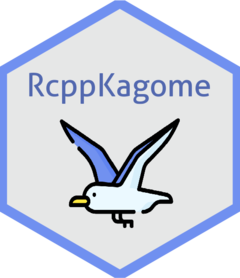

<!-- README.md is generated from README.Rmd. Please edit that file -->

# RcppKagome <a href='https://paithiov909.github.io/RcppKagome'></a>

<!-- badges: start -->

[](#)
[](https://travis-ci.org/paithiov909/RcppKagome)
[](https://github.com/paithiov909/RcppKagome/blob/master/LICENSE)
<!-- badges: end -->

> ‘Rcpp’ Interface to Kagome

## About

Interface to [ikawaha/Kagome](https://github.com/ikawaha/kagome);
Self-contained Japanese morphological analyzer written in pure Go.

## System Requirements

  - GNU make
  - GNU GCC
  - Go
  - C++11

## Installation

``` r
remotes::install_github("paithiov909/RcppKagome")
```

**Linuxでコケる場合（未確認）**

``` r
remotes::install_github("paithiov909/RcppKagome", INSTALL_opts = c("--no-test-load"))
```

## Usage

``` r
res <- RcppKagome::kagome("東京特許許可局")
print(res)
#> [[1]]
#> [[1]]$`1`
#> [[1]]$`1`$Id
#> [1] 250022
#> 
#> [[1]]$`1`$Start
#> [1] 0
#> 
#> [[1]]$`1`$End
#> [1] 2
#> 
#> [[1]]$`1`$Surface
#> [1] "東京"
#> 
#> [[1]]$`1`$Feature
#> [1] "名詞"       "固有名詞"   "地域"       "一般"       "*"         
#> [6] "*"          "東京"       "トウキョウ" "トーキョー"
#> 
#> 
#> [[1]]$`2`
#> [[1]]$`2`$Id
#> [1] 285848
#> 
#> [[1]]$`2`$Start
#> [1] 2
#> 
#> [[1]]$`2`$End
#> [1] 4
#> 
#> [[1]]$`2`$Surface
#> [1] "特許"
#> 
#> [[1]]$`2`$Feature
#> [1] "名詞"     "サ変接続" "*"        "*"        "*"        "*"        "特許"    
#> [8] "トッキョ" "トッキョ"
#> 
#> 
#> [[1]]$`3`
#> [[1]]$`3`$Id
#> [1] 347256
#> 
#> [[1]]$`3`$Start
#> [1] 4
#> 
#> [[1]]$`3`$End
#> [1] 6
#> 
#> [[1]]$`3`$Surface
#> [1] "許可"
#> 
#> [[1]]$`3`$Feature
#> [1] "名詞"     "サ変接続" "*"        "*"        "*"        "*"        "許可"    
#> [8] "キョカ"   "キョカ"  
#> 
#> 
#> [[1]]$`4`
#> [[1]]$`4`$Id
#> [1] 195583
#> 
#> [[1]]$`4`$Start
#> [1] 6
#> 
#> [[1]]$`4`$End
#> [1] 7
#> 
#> [[1]]$`4`$Surface
#> [1] "局"
#> 
#> [[1]]$`4`$Feature
#> [1] "名詞"   "接尾"   "一般"   "*"      "*"      "*"      "局"     "キョク"
#> [9] "キョク"
```

``` r
res <- RcppKagome::kagome(c("東京特許許可局", "赤巻紙青巻紙黄巻紙"))
res <- RcppKagome::prettify(res)
head(res)
#>   Sid Surface POS1     POS2 POS3 POS4 X5StageUse1 X5StageUse2 Original
#> 1   1    東京 名詞 固有名詞 地域 一般           *           *     東京
#> 2   1    特許 名詞 サ変接続    *    *           *           *     特許
#> 3   1    許可 名詞 サ変接続    *    *           *           *     許可
#> 4   1      局 名詞     接尾 一般    *           *           *       局
#> 5   2      赤 名詞     一般    *    *           *           *       赤
#> 6   2    巻紙 名詞     一般    *    *           *           *     巻紙
#>        Yomi1      Yomi2
#> 1 トウキョウ トーキョー
#> 2   トッキョ   トッキョ
#> 3     キョカ     キョカ
#> 4     キョク     キョク
#> 5       アカ       アカ
#> 6   マキガミ   マキガミ
```

## Code of Conduct

Please note that the RcppKagome project is released with a [Contributor
Code of
Conduct](https://paithiov909.github.io/RcppKagome/CODE_OF_CONDUCT.html).
By contributing to this project, you agree to abide by its terms.

## License

Copyright (c) 2020 Kato Akiru

Released under the MIT license
<https://github.com/paithiov909/RcppKagome/blob/master/LICENSE>

> [Kagome](https://github.com/ikawaha/kagome) is licensed under the
> Apache License v2.0 and uses the MeCab-IPADIC, UniDic
> dictionary/statistical model. See
> [NOTICE.txt](https://github.com/ikawaha/kagome/blob/master/NOTICE.txt)
> for license details.

Icons made by [Freepik](http://www.freepik.com/) from
[www.flaticon.com](https://www.flaticon.com/).
